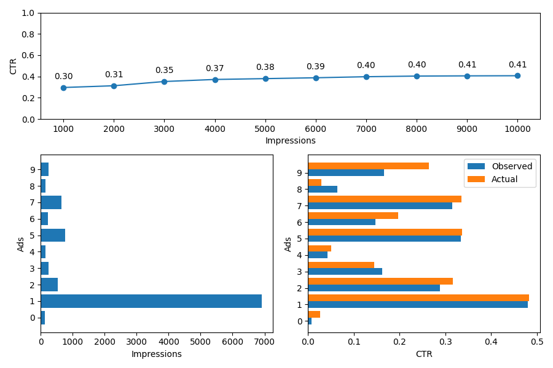

[](https://travis-ci.com/falox/gym-adserver)
[](https://codecov.io/gh/falox/gym-adserver)

# gym-adserver

`gym-adserver` is an [OpenAI Gym](https://github.com/openai/gym) environment for reinforcement learning-based online advertising algorithms.

The `AdServer` environment implements a typical [multi-armed bandit problem](https://en.wikipedia.org/wiki/Multi-armed_bandit) where an [ad server](https://en.wikipedia.org/wiki/Ad_serving) must select one advertisement (ad) to display in a web page.

Each time an ad is selected and displayed, it is counted as one [impression](https://en.wikipedia.org/wiki/Impression_(online_media)). A displayed ad can be clicked (reward = 1) or not (reward = 0), depending on the interest of the user.

The ad server, and therefore the agent, must maximize the overall [click-through rate](https://en.wikipedia.org/wiki/Click-through_rate).

### OpenAI Environment Attributes

| Attribute | Value | Notes
|--|--|--|
| Action Space | Discrete(_n_) |  _n_ is the number of ads to choose from
| Observation Space| Box(0, +inf, (2, n)) | Number of impressions and clicks for the _n_ ads
| Actions | [0...n] | Index of the selected ad
| Rewards | 0, 1 | 1 = clicked, 0 = not clicked
| Render Modes | 'human' | Displays the agent's performance graphically

## Installation

You can download the source code and install the dependencies with:

```bash
git clone https://github.com/falox/gym-adserver
cd gym-adserver
pip install -e .
```

## Basic Usage

You can test the environment by running one of the built-in agents:

```bash
python gym_adserver/agents/ucb1_agent.py --num_ads 10 --impressions 10000
```

The environent will generate 10 (`num_ads`) ads with different performance rates and the agent, without prior knowledge, will learn to select the most performant ads. The simulation will last 10000 iterations (`impressions`).

A window will open and show the agent's performance:



The overall CTR increases over time, since the agent learns the best actions. 

The "Actual CTR" is the probability for an ad to be clicked and it's known only by the environment. The "Observed CTR" is an estimate calculated by the agent and, with time, comes close to the actual.

The most performant ads will receive more impressions.

## Built-in Agents

The _gym_adserver/agents_ directory contains the agents implementing the following strategies:

- Random
- [epsilon-Greedy](https://en.wikipedia.org/wiki/Multi-armed_bandit#Semi-uniform_strategies)
- [Softmax](https://en.wikipedia.org/wiki/Softmax_function#Reinforcement_learning)
- [UCB1](https://en.wikipedia.org/wiki/Monte_Carlo_tree_search#Exploration_and_exploitation)

Each agent has different parameters to adjust and optimize the associated algorithm.

You can use the built-in agents as a starting point to implement your own algorithm.

## Unit Tests

You can run the unit test for the environment with:

```bash
pytest -v
```

## Next Steps

- Extend AdServer with the concepts of _budget_ and _bid_
- Extend AdServer to change the ad performance over time (currently the CTR is constant)
- Implement [Q-learning](https://en.wikipedia.org/wiki/Q-learning) agents
- Implement a meta-agent that exploits multiple sub-agents with different algorithms
- Implement epsilon-Greedy variants
- Implement an environment/wrapper to run and compare multiple agents